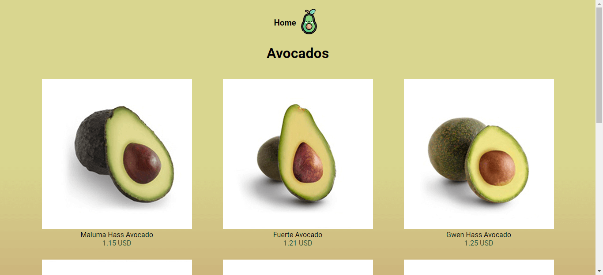

# Avocado App Creada con React

Hola, bienvenidos al repositorio Avocado App.

## Comenzando 🚀

Para hacerlo funcionar, te invito a clonar o forkear el repo. Una vez descargado, abre la terminal de comandos y ubicate en la carpeta del proyecto.

## Scripts Disponibles 📌

En el directorio del proyecto puedes ejecutar:

### `npm i ó npm install`

Para instalar todas las dependencias que requiere el proyecto para funcionar.

### `npm run dev`

Corre la aplicación en modo desarrollo un tu servidor local en tu computadora.
Abre [http://localhost:3000](http://localhost:3000) para verlo en el navegador.

### `npm run build`

Una vez realizado todos los cambios deseados con este comando crearas un bundle optimizado del proyecto listo para desplegar a producción.

### `npm start`

Corre la aplicación en modo producción un tu servidor local en tu computadora.
Abre [http://localhost:3000](http://localhost:3000) para verlo en el navegador.

## Despliegue 📦

Podrás visitar la aplicación en el siguiente [enlace](https://curso-nextjs-platzi.vercel.app/)

## Construido con 🛠️

HTML, CSS, JavaScript, TypeScript, React Js, Next Js y Semantic UI.

---

⌨️ con ❤️ por [dbriceno10](https://github.com/dbriceno10) 😊
